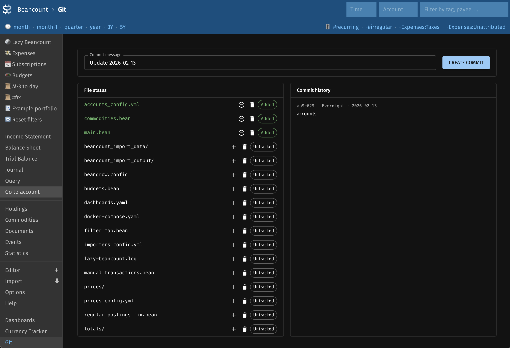

# fava-git

A [Fava](https://beancount.github.io/fava/) plugin that helps manage Beancount files using git.




## Features

- **Git status dashboard**: View all files in the repository with their git status (modified, added, deleted, untracked, etc.) in a table.
- Enables simple git operations to make sure your changes are always safe.
- Runs git operations via `subprocess.check_output` from the directory containing your main Beancount file.

## Installation

```bash
uv pip install -e .
# or: pip install -e .
```

Build the frontend (required for the Git report):

```bash
cd frontend && npm install && npm run build
```

## Configuration

Add the extension to your Beancount file:

```
2020-01-01 custom "fava-extension" "fava_git"
```

Then open your ledger in Fava and use the **Git** report in the sidebar.
